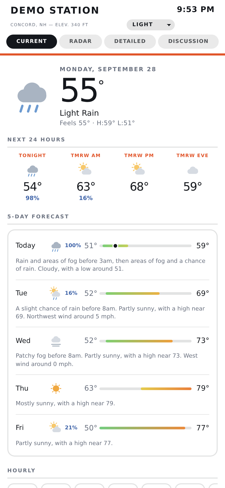
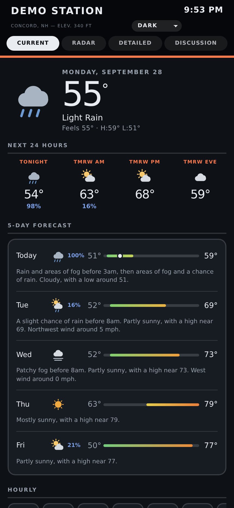
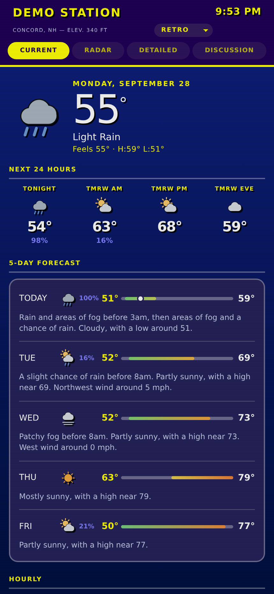
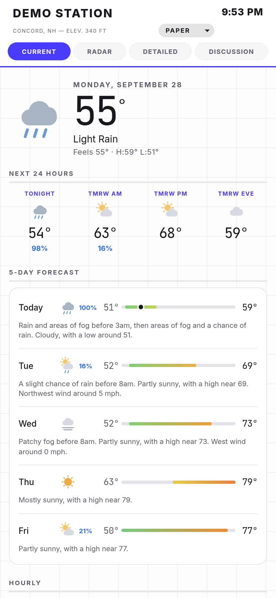
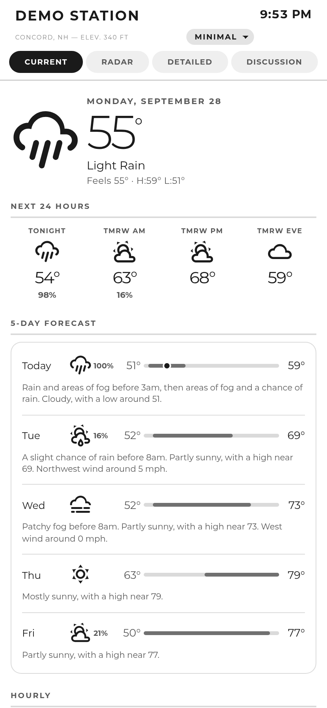
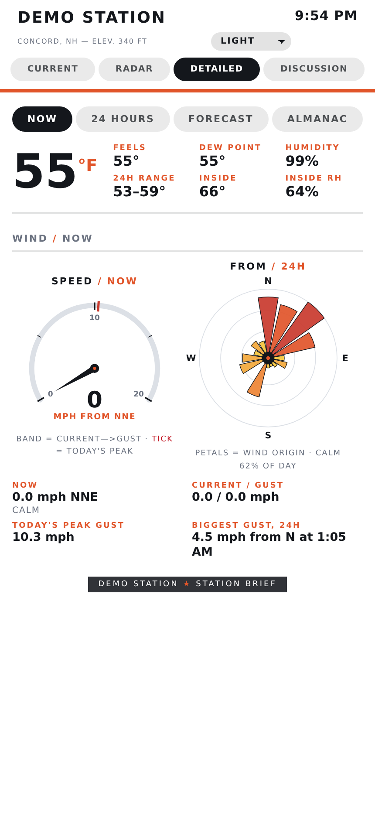
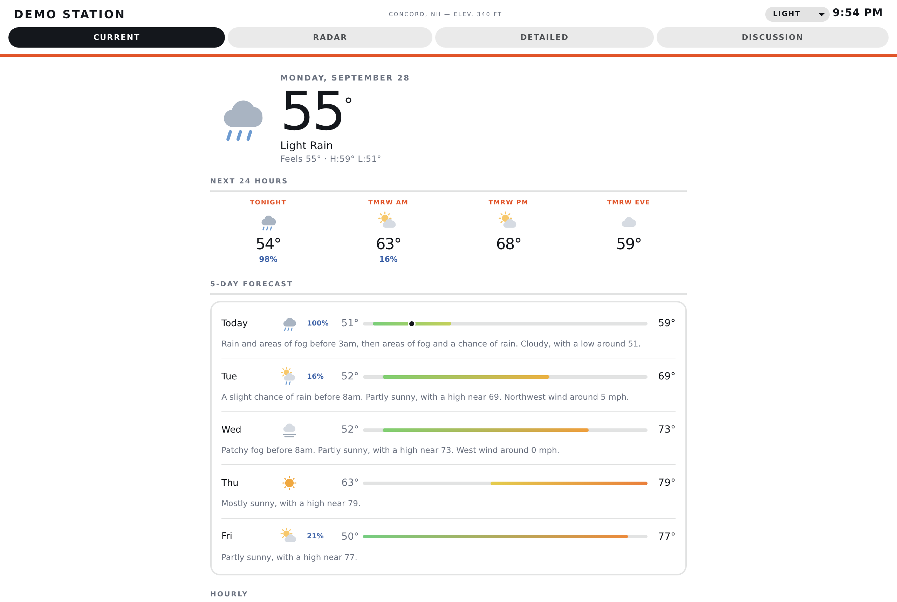

# tradweather

A personal weather page that **calibrates public forecast models against your own station's history**, so the forecast describes your yard instead of the nearest town.

One Python script, standard library only. It renders a static HTML page every sixty seconds; a tiny HTTP server serves it. No database, no framework, no build step.

| Light | Dark | Retro | Paper | Minimal |
|---|---|---|---|---|
|  |  |  |  |  |

 

Screenshots are from a demo configuration, not a real station location.

---

## Why

Open a weather app at my house, on a hill in northern New England, and it describes the town down in the valley. It is not wrong, it is answering a question about a different place.

The station on the roof already knew what the weather *was*. What was missing was a forecast that knew anything about this specific hill. That is what this does: for every day your station has recorded, it fetches the archived model forecast for your exact point and compares it to what you actually measured. The ratio is your correction.

At my site the wind factor runs about **0.30 in bare March and 0.15 in leaf-on July**. The model says twelve mph, the hill delivers two. That is not model error, it is canopy — and no general-purpose app can know it, because none of them have your yard's history.

## What you get

| View | Contents |
|---|---|
| **Current** | Conditions hero, next-24-hours day parts, five-day strip, hourly strip, station instruments |
| **Radar** | Animated NEXRAD composite with storm tracks and NWS warning polygons, scrubbable |
| **Detailed** | Four panes — Now (wind gauge + rose), 24 Hours (temp/dew/RH, wind, rain, pressure), Forecast (120h trend, multi-model spaghetti, 7-day), Almanac (rain totals, sun/moon, 30 days) |
| **Discussion** | The raw NWS area forecast discussion, reflowed to be readable |

**Five themes** — light, dark, a retro one inspired by the WeatherStar 4000 cable weather channel, a graph-paper one, and a greyscale e-ink-style minimal that swaps the drawn icons for Material Design Icons. PWA-installable, and a machine-readable `weather.json` for Home Assistant or anything else.

## Requirements

- An **[Ambient Weather](https://ambientweather.net/)** station and its two API keys.
- Docker, or any machine with Python 3.11+ and nothing else.
- **A United States location**, for the full feature set. See the caveat below.

## Quick start

```bash
git clone https://github.com/tfarrell145/homelab-builds.git
cd homelab-builds/tradweather
cp config.example.json config.json
$EDITOR config.json          # keys, coordinates, timezone, contact address
docker compose up -d
```

Open `http://localhost:8788`.

The first render bootstraps everything it needs. You do not have to seed anything.

Then, once you have a few weeks of record, calibrate:

```bash
docker compose exec tradweather python3 /config/history_builder.py   # backfill
docker compose exec tradweather python3 /config/calibrate.py         # compute factors
```

Full instructions, including running without Docker, are in **[SETUP.md](SETUP.md)**.

## Configuration

Everything site-specific lives in `config.json`. It is gitignored; your keys never leave your machine.

| Key | Notes |
|---|---|
| `api_key`, `application_key` | ambientweather.net → Account → API Keys. Two different keys. |
| `device_mac` | Your station's MAC, from the same page. |
| `latitude`, `longitude` | **The exact station point, 4+ decimals.** Do not guess from the town name. |
| `elevation_ft`, `station_name`, `location` | Cosmetic, except elevation. |
| `timezone` | IANA name. Timestamps are local to the station, not to the viewer. |
| `contact_email` | NWS rejects requests without a User-Agent carrying a real contact. |
| `port` | Defaults to 8788. |

### Get the coordinates right before you calibrate anything

An early build of this ran two days on a point six kilometres off. Every calibration constant had to be recomputed. Four decimals minimum, from the Ambient app's station settings or a map pin on the actual house.

## The calibration, in brief

`calibrate.py` reads your `history.csv` and writes `calibration.json` and `wind_run_dist.json`.

- **Wind, per month.** Daily ratio of observed average to forecast mean, median per month. This is where your canopy shows up.
- **Wind, per direction.** The same ratio bucketed into eight sectors, which finds the directions your site is open to.
- **Gusts.** One flat factor. Mine is ~0.49 and it barely moves by season or direction — sustained wind is taxed by trees, gusts are momentum from above and largely ignore them.
- **Precipitation model.** Each model's total summed against your gauge over the whole record. At my site ECMWF came in at **86.4%** and GFS at **53.5%**, so the page uses ECMWF-only for amounts. Verify at yours; expect ECMWF to win, but let the data say so.
- **Wind run distribution.** Percentiles of daily wind run, which turn an abstract number into `30 mi · 81st percentile · breezy` — relative to your site, not a generic scale.

Re-run it periodically. It improves on its own as your record grows. Until it has run, the page displays the raw model output and says `calibration pending` under the forecast wind chart.

## Caveats

**NWS features are United States only.** The forecast, alerts, the area forecast discussion and the NEXRAD radar all come from NOAA. Outside the US the station panels and the Open-Meteo model charts still work; the NWS sections render empty. Nothing crashes, but you would be using perhaps half of it.

**Calibration needs a season.** It is genuinely useful after a few weeks and honest after a year. My own record is still spring-and-summer-only, so eight of my twelve monthly wind factors are still fallback values.

**Serve only `public/`.** The config file with your API keys lives beside the renderer, not under it. The container and compose file already do this correctly; if you wire up your own server, do not point it at the project root.

## What it calls, and how often

Every install talks to free public services. Be a good neighbour to them.

| Service | For | How often |
|---|---|---|
| Ambient Weather API | your station's current readings | every render, 60 s |
| NWS (api.weather.gov) | forecast, hourly, alerts, forecast discussion | cached 30 min; needs `contact_email` in the User-Agent |
| Open-Meteo | model forecasts; archive for calibration | forecast cached 30 min, archive 10 min; `calibrate.py` requests history in ~1-year chunks, only when you run it |
| Iowa Environmental Mesonet | NEXRAD radar tiles | only while the Radar view is open |
| CARTO | radar basemap tiles | only while the Radar view is open |

Open-Meteo's free tier is for non-commercial use. Fonts, charts, the map library and icons are served from this folder (`vendor/`), so a page load makes no other third-party requests.

## Credits and third-party

- **Porter Haney's** Hilltop House dashboard is the original: the renderer's structure, and the whole idea of scoring forecast models against your own gauge. This is that work re-pointed at a different vendor's API and a different hill, published with his blessing. The good ideas are his.
- The retro theme's palette comes from the [ws4kp](https://github.com/netbymatt/ws4kp) WeatherStar 4000 simulator.
- Bundled in `vendor/`, each with its licence: Chart.js 4.5.0 (MIT), Leaflet 1.9.4 (BSD-2-Clause), Material Design Icons 7.4.47 (Apache 2.0 / SIL OFL), and the Inter, JetBrains Mono, Montserrat and Lato fonts (SIL OFL 1.1). Versions and sources: [vendor/README.md](vendor/README.md).
- Data: National Weather Service, Open-Meteo, Iowa Environmental Mesonet, Ambient Weather.

## Licence

MIT. See [LICENSE](LICENSE). The bundled third-party files keep their own licences.
